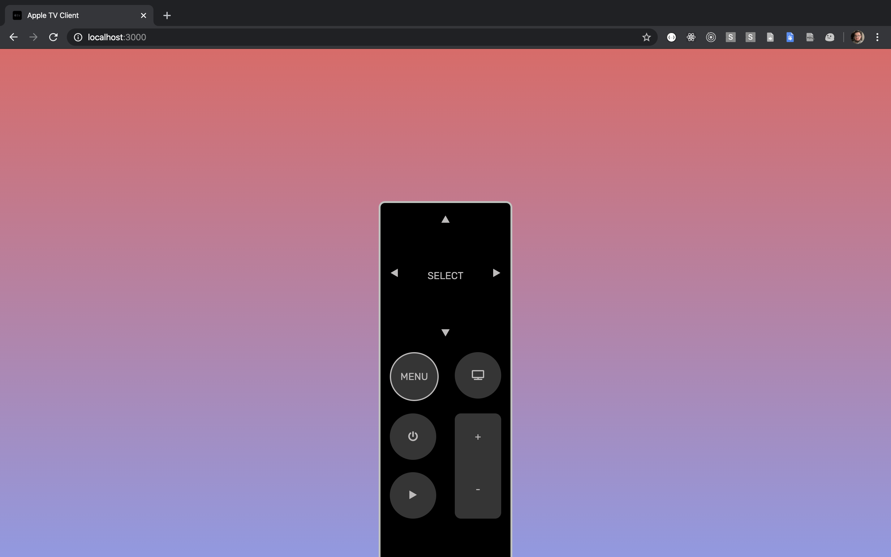

# Apple TV Remote

A Web Client Remote for your Apple TV

## Usage

### Set Up

1. Clone this repository and run `npm i`
2. Connect to the same network the target Apple TV is on.
3. At the root of this repo, run `npm run pair` to connect to your device
4. Run `npm start` - The remote client will be available at `localhost:3000`
